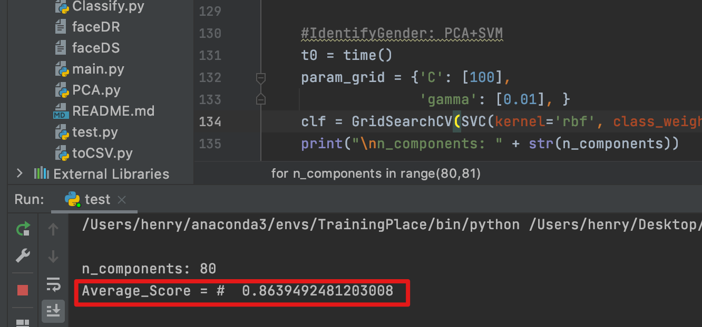
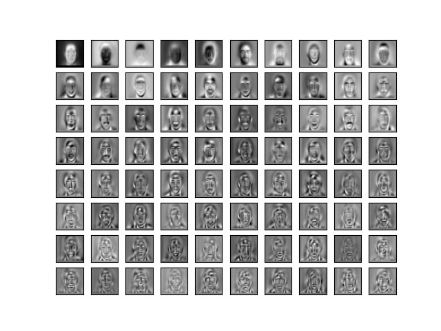
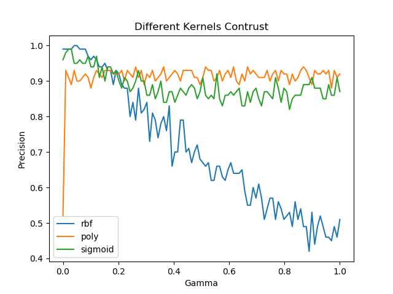
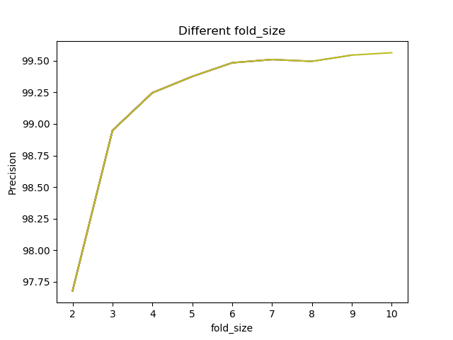
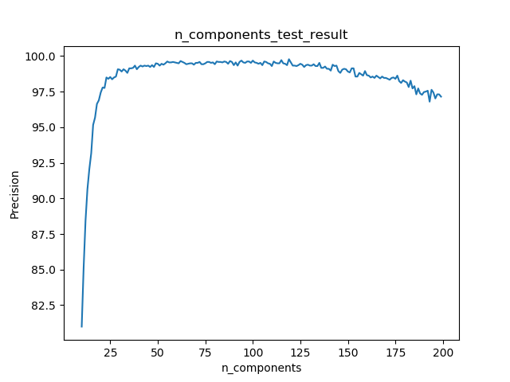
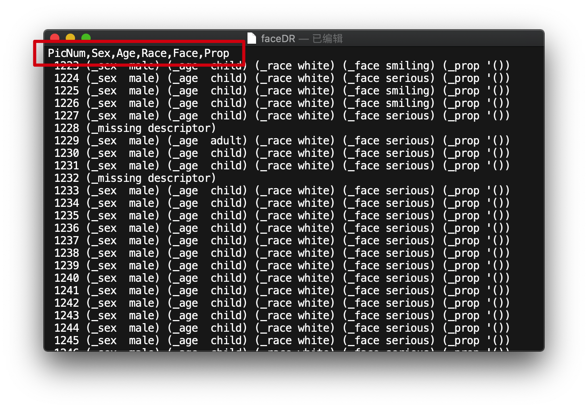
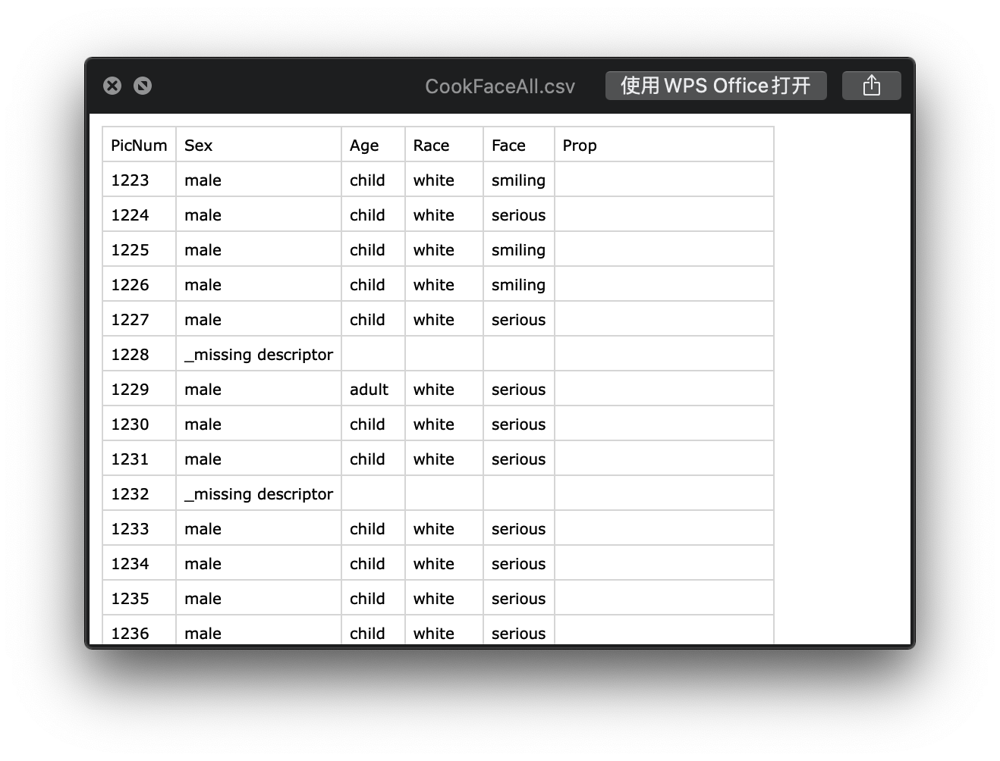
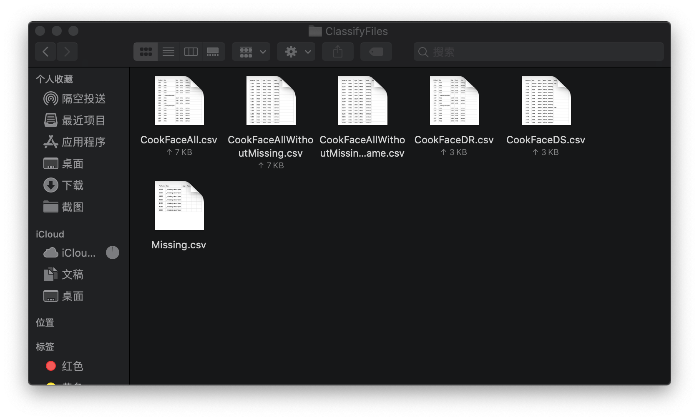

# PCA+SVM性别识别
 本程序采用PCA+SVM+交叉验证方法对老师所提供的人脸数据集（数据集在./rawdata中）进行训练，并得出识别准确率（86%左右）。
 
## 开发环境
 
 * Python 3.8.5 x64
 * MacOS 15.7（未在Windows下测试，可能会出现文件路径问题）

## IDE
 * PyCharm 2021.03

## 依赖包

* numpy
* pandas
* scikit-learn

## 程序功能
### 对**PCA+SVM2Gender.py**文件
1. Eigenfaces输出

	

2. 准确率随不同gamma和核函数变化曲线，由曲线选择**rbf**

	

3. k重交叉验证的k值对准确率的影响，由曲线选择10

	

4. PCA保留的主成分数n_components对准确率的影响，由曲线选择80左右

	

### 对**2CSV.py**文件
老师所提供的 **faceDR** 和 **faceDS** 有部分图片信息缺失和部分图片维度不一致（2412和2416为「512\*512」，其他图片都为「128\*128」，因为不一致数量极少，故全部去除）
1. 对于老师文件做了一点小修改，在其表头手动添加了部分参数，方便Pandas处理
	
2. 运行 **2CSV.py**文件可以直接获得去除杂七杂八，保留纯粹信息的CSV文档
	
3. 对于常用的CSV文件已经整理放在./ClassifyFiles中
	
	其中：
	+ **CookFaceDR**：整理好的老师faceDR文件；
	+ **CookFaceDS**：整理好的老师faceDS文件；
	+ **Missing**：将那些缺失信息的全部独立拿出来；
	+ **CookFaceAll**：将整理好的faceDR和faceDS合并好的文件；
	+ **CookFaceAllWithoutMissing**：将整理好的faceDR和faceDS合并好，并去除缺失信息的文件；
	+ **CookFaceAllWithoutMissingWithSame**：将整理好的faceDR和faceDS合并好，并去除缺失信息和维度不一致图像的文件（最常用）；
	
## 致谢
1. [PCA+SVM人脸识别](https://github.com/zhang-can/SVM_PCA_face_detection)